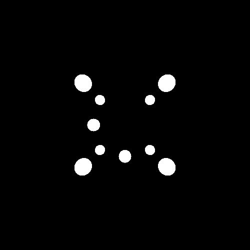
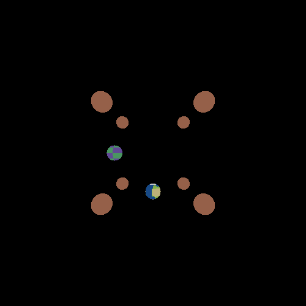
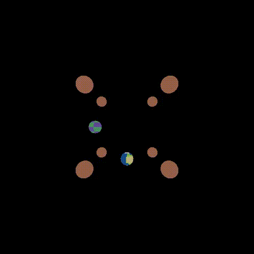
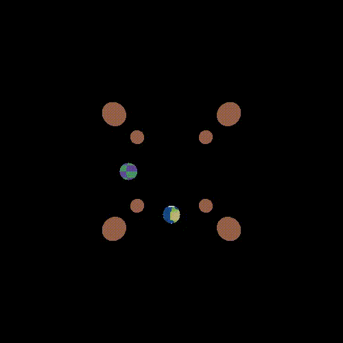
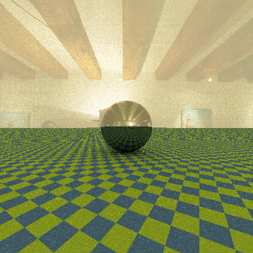
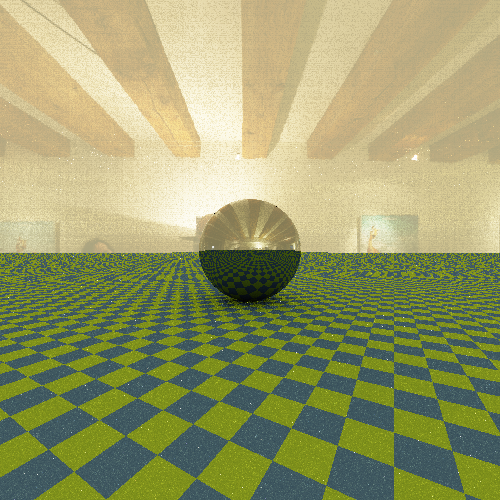
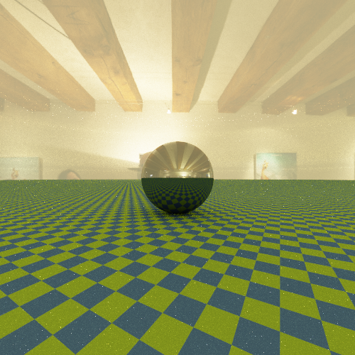

# Photorealistic Ray Tracer

A C# application for generating photorealistic images using different rendering algorithms.

## Table of Contents

- [Purpose](#purpose)
- [How to install it](#how-to-install-it)
- [Usage](#usage)
- [Scripts](#scripts)
- [Scene Description Language](#scene-description-language)
- [Command Options](#command-options)
- [Examples](#examples)
- [Where to ask for help](#where-to-ask-for-help)
- [Future developments](#future-developments)
- [How to contribute](#how-to-contribute)
- [Authors](#authors)
- [License](#license)
- [State of the project](#state-of-the-project)

---

## Purpose

This project is a ray tracing renderer written in C# that generates photorealistic images from scene descriptions provided in text files.

---

# How to install it

## Prerequisites

Before building the project, install the following software:

- .NET 10 SDK
- Bash
- GNU Parallel (optional, required for animation generation)
- FFmpeg (required by `generate-animation.sh`)

---

## Clone the Repository

Clone the repository and move into the project directory:

```bash
git clone git@github.com:GiacomoBeretta/RayTracer
cd RayTracer
```

---

## Build the Project

Build the solution using the .NET CLI:

```bash
dotnet build
```

---

## Run the Renderer

The renderer can be executed through the provided Bash scripts or directly using the generated executable.

Example:

```bash
./raytracer.sh render
```

Generated images will be saved in the corresponding output directories.

The main application can be launched either through the provided scripts or directly from the .NET project entry point using:

```bash
dotnet run -- <command>
```

---

## Development Environment

The project was primarily developed and tested using JetBrains Rider.

---

## Supported Platforms

This program works on:

### Ubuntu

```text
Ubuntu 24.04 LTS
```
The unit tests were run on the following operating systems with the latest version of dotnet 10.0.x and they were all successful:

### Windows

```text
OS Name:                       Microsoft Windows Server 2025 Datacenter
OS Version:                    10.0.26100 N/A Build 26100
BIOS Version:                  Microsoft Corporation Hyper-V UEFI Release v4.1, 1/8/2026
```

### macOS

```text
ProductName:                   macOS
ProductVersion:                15.7.7
BuildVersion:                  24G720
```

---

# Usage

The program provides several commands:

## Commands

### render

Reads a scene description from a text file and generates the corresponding image.

> **Note:** The scene file must be located inside the `Scene` directory at build time while the corrisponding pfm and png images will be saved in the `PfmImages` and `PngImages` directories correspondly

---

### averageimage

Generates a new image by averaging multiple PFM (Portable Float Map) images of the same scene rendered using different random generator states and sequence identifiers.

The averaging is performed pixel by pixel in order to reduce image variance and noise.

This command is designed to work together with the `raytracer.sh` script.

When the script is configured to generate multiple renders using different random generator states and sequence identifiers, the generated PFM files are saved using the naming convention:

```bash
${outputpfm%.pfm}_state${state}_seq${seq}.pfm
```

The command automatically filters the files contained in the input directory and processes only the files matching this pattern.

> **Note:** The pfm files must be located inside the `PfmImages` directory at build time while the corrisponding pfm and png averaged images will be saved in the `PfmImages` and `PngImages` directories correspondly

---

### pfmtopng

Converts images from the PFM (Portable Float Map) image format to PNG format.

> **Note:** The pfm files must be located inside the `PfmImages` directory at build time while the corrisponding png images will be saved in the `PngImages` directoriy

---

# Scripts

The project includes three Bash scripts that simplify image generation and post-processing operations:

- `raytracer.sh`
- `config.sh`
- `generate-animation.sh`

---

## config.sh

This file contains the default values used by the different commands supported by the renderer.

By modifying the values in this file it is possible to generate different images without specifying all parameters from the command line.

In particular, the following options can be specified as arrays:

- `initstate`
- `initseq`
- `declarefloat`

The file also defines a boolean variable named:

```bash
pcgcycle=false
```

which controls how multiple random generator states and sequence identifiers are handled.

When `pcgcycle` is set to `false` (default value), only the first value of the `initstate` and `initseq` arrays is used during rendering.

When `pcgcycle` is set to `true`, the renderer is executed for every combination of state and sequence identifier contained in the two arrays.

Example:

```bash
initstate=(45 12)
initseq=(54 2)
```

produces:

```text
state=45, seq=54
state=45, seq=2
state=12, seq=54
state=12, seq=2
```

---

## raytracer.sh

This script automates the execution of the renderer.

It loads the default values from `config.sh`, allows them to be overridden from the command line, and invokes the selected command with the appropriate parameters.

When `pcgcycle=true`, the script automatically executes the rendering process for every combination of random generator state and sequence identifier defined in `config.sh`.

The generated files are named:

```bash
${outputpfm%.pfm}_state${state}_seq${seq}.pfm
```

and:

```bash
${outputpng%.png}_state${state}_seq${seq}.png
```

This naming scheme is also used by the `averageimage` command to identify the images that must be averaged.

---

## generate-animation.sh

This script converts a sequence of PNG images into an MP4 video.

The script is designed to process images in the `PfmImages` directory whose filenames follow the pattern:

```text
frame_%03d.png
```

Examples:

```text
frame_000.png
frame_001.png
frame_002.png
...
```

All matching images are combined into a single MP4 animation.

The images can be generated automatically using the GNU Parallel library.

A generic command has the following form:

```bash
seq -w START_VALUE END_VALUE | parallel -j NUM_CORES ./raytracer.sh render --declarefloat VARIABLE_NAME:{} --outputpfm frame_{}.pfm --outputpng frame_{}.png
```

where:

- `START_VALUE` and `END_VALUE` define the range of values over which the animation is generated. A common use case is to let these values represent rotation angles.
- `NUM_CORES` is the number of CPU cores used in parallel by GNU Parallel.
- `VARIABLE_NAME` is the name of a floating-point variable declared inside the scene description file (`scene.txt`).

The variable can then be used inside transformations defined in the scene.

For example, if a transformation depends on a variable named `clock`, the command will render one frame for each value in the specified range and substitute the current value into the variable.

This mechanism allows the generation of animation frames by varying a scene parameter such as:

- object rotation;
- object translation;
- camera movement;
- any other transformation controlled by a floating-point variable declared in the scene file.

The generated frames are saved using the naming convention:

```text
frame_000.png
frame_001.png
frame_002.png
...
```

and can subsequently be combined into an MP4 animation using `generate-animation.sh`.

---

# Scene Description Language

Scenes are described through a custom text-based language.

The scene language allows the definition of:

- floating-point variables;
- vectors;
- colors;
- materials;
- pigments;
- BRDFs;
- transformations;
- geometric primitives;
- cameras.

An example scene is shown below:

```text
# Declare a floating-point variable named "clock"
float clock(150)

material sky_material(
    diffuse(image("dome.pfm")),
    uniform(<0.7, 0.5, 1>)
)

material ground_material(
    diffuse(checkered(<0.3, 0.5, 0.1>,
                      <0.1, 0.2, 0.5>, 4)),
    uniform(<0, 0, 0>)
)

material sphere_material(
    specular(uniform(<0.5, 0.5, 0.5>)),
    uniform(<0, 0, 0>)
)

sphere(sphere_material, translation([0, 0, 1]))

plane(ground_material, identity)

plane(sky_material,
      translation([0, 0, 100]) * rotation_y(150))

camera(
    perspective,
    rotation_z(clock) * translation([-4, 0, 1]),
    1.0,
    1.0
)
```

---

## Floating-Point Variables

Floating-point variables can be declared using:

```text
float name(value)
```

Example:

```text
float clock(150)
```

Variables can be used wherever a floating-point value is expected.

---

## Vectors

Vectors are defined using square brackets:

```text
[x, y, z]
```

Example:

```text
[1, 2, 3]
```

---

## Colors

Colors are defined using angular brackets:

```text
<r, g, b>
```

Example:

```text
<0.5, 0.3, 0.1>
```

The color components `r`, `g`, and `b` are floating-point values.

Values in the range `[0, 1]` represent the standard visible intensity range, although higher values are allowed.

---

## Materials

Materials are defined using:

```text
material name_material(BRDF(pigment), emitted_radiance)
```

Example:

```text
material sphere_material(
    specular(uniform(<0.5, 0.5, 0.5>)),
    uniform(<0, 0, 0>)
)
```

A material is composed of:

- a BRDF;
- an emitted radiance pigment.

Materials are stored using their declared identifier and can be referenced by geometric primitives.

The material name is used to associate a material with an object.

---

### BRDFs

A BRDF is defined as:

```text
Keyword_BRDF(pigment)
```

where `Keyword_BRDF` can be:

- `diffuse`
- `specular`

Examples:

```text
diffuse(uniform(<1, 0, 0>))
```

```text
specular(uniform(<1, 1, 1>))
```

---

### Pigments

Pigments are defined as:

```text
Keyword_Pigment(...)
```

where `Keyword_Pigment` can be:

- `uniform`
- `checkered`
- `image`

---

#### Uniform Pigment

```text
uniform(color)
```

Example:

```text
uniform(<1, 0, 0>)
```

---

#### Checkered Pigment

```text
checkered(color1, color2, num_step)
```

Example:

```text
checkered(<1,0,0>, <0,0,1>, 8)
```

---

#### Image Pigment

```text
image(filename)
```

Example:

```text
image("texture.pfm")
```

---

## Geometric Primitives

Currently supported primitives are:

- `sphere`
- `plane`

Both primitives require a previously defined material identifier and a transformation.

---

### Sphere

A sphere is defined as:

```text
sphere(name_material, transformation)
```

Example:

```text
sphere(
    sphere_material,
    translation([0,0,1])
)
```

---

### Plane

A plane is defined as:

```text
plane(name_material, transformation)
```

Example:

```text
plane(
    ground_material,
    identity
)
```

---

### Material Declaration Order

Materials must be declared before the geometric primitives that use them.

The material identifier passed to a primitive must refer to an existing material.

The parser must know the material before the primitive is defined.

A material definition cannot be directly embedded inside a primitive definition.

The material must always be defined separately and referenced by its identifier.

---

## Transformations

Transformations are defined using specific keywords.

### Identity

```text
identity
```

---

### Translation

```text
translation(vector)
```

Example:

```text
translation([1,0,0])
```

---

### Rotation Around X

```text
rotation_x(angle)
```

---

### Rotation Around Y

```text
rotation_y(angle)
```

---

### Rotation Around Z

```text
rotation_z(angle)
```

where `angle` is expressed in degrees.

---

### Scaling

```text
scaling(x, y, z)
```

Example:

```text
scaling(2,1,1)
```

---

### Transformation Composition

An arbitrary number of transformations can be concatenated using the `*` operator.

Example:

```text
translation([0,0,1]) *
rotation_y(45) *
scaling(2,2,2)
```

---

## Cameras

Cameras are defined as:

```text
camera(
    Keyword_camera,
    transformation,
    aspect_ratio,
    distance
)
```

where `Keyword_camera` can be:

- `orthogonal`
- `perspective`

Example:

```text
camera(
    perspective,
    identity,
    1.0,
    1.0
)
```

---

### Note on Orthogonal Cameras

Although an orthogonal camera does not use the `distance` parameter internally, the parameter must still be specified in order for the scene to be parsed correctly.

---

## Comments

Comments can be inserted using the `#` character.

Example:

```text
# This is a comment
float clock(45)
```

---

# Command Options

## Common Options

The following options are available in all the commands.

#### `--luminosityfunction`

Luminosity function used during tone mapping to compute image brightness.

Available options:

- `shirley`
- `weighted`

#### `--averageluminosity`

Average luminosity value used during tone mapping.

When specified, the image luminosity is normalized using this value instead of computing it automatically from the image.

#### `--factor`

Empirical scaling factor applied during tone mapping.

Higher values generally produce brighter images, while lower values produce darker images.

#### `--gamma`

Gamma correction factor applied after tone mapping.

---

## Render Command

### Available Options

#### `--inputrender`

Name of the scene file to be rendered.

The file must be located inside the `Scene` directory.

#### `--width`

Output image width in pixels.

#### `--height`

Output image height in pixels.

#### `--algorithm`

Rendering algorithm to use.

Available options:

- `onoff`
- `flat`
- `pathtracer`

#### `--outputpfm`

Name of the generated PFM image.

The file will be saved in the `PfmImages` directory.

#### `--outputpng`

Name of the generated PNG image.

The file will be saved in the `PngImages` directory.

#### `--numrays`

Number of rays scattered at each reflection.

Used only when the selected algorithm is `pathtracer`.

#### `--maxdepth`

Maximum recursion depth for each ray.

It represents the maximum number of reflections a ray can undergo before returning the background color.

Used only when the selected algorithm is `pathtracer`.

#### `--initstate`

Initial state for the random number generator.

#### `--initseq`

Sequence identifier used by the random number generator.

#### `--sampleside`

Number of subdivisions per pixel side used for anti-aliasing.

#### `--declarefloat` or `-d`

Declares a floating-point variable using:

```bash
--declarefloat=NAME:VALUE
```

#### `--roulettestart`

Number of reflections after which the Russian Roulette termination algorithm starts.

#### `--rouletteprob`

Optional fixed probability used by the Russian Roulette algorithm.

If omitted, the probability is computed dynamically at each recursion step.

The following common options are also available:

- `--luminosityfunction`
- `--averageluminosity`
- `--factor`
- `--gamma`

---

## Average Image Command

### Available Options

#### `--inputaverage`

Name of the directory containing the PFM files to be averaged.

#### `--outputaveragepfm`

Name of the generated averaged image as a pfm file.

#### `--outputaveragepng`

Name of the generated average image as a png file.

The command generates both a PFM image and its corresponding PNG representation.

The following common options are also available:

- `--luminosityfunction`
- `--averageluminosity`
- `--factor`
- `--gamma`

---

## PFM to PNG Command

### Available Options

#### `--inputpfm`

Name of the PFM file to convert.

#### `--output`

Name of the generated PNG image.

The following common options are also available:

- `--luminosityfunction`
- `--averageluminosity`
- `--factor`
- `--gamma`

---

# Examples

The following examples showcase the different rendering algorithms and image generation features supported by the renderer.

---

## On/Off Rendering

The `onoff` algorithm performs a binary visibility test and colors a pixel only when a ray intersects an object.



---

## Flat Rendering

The `flat` algorithm computes surface colors without global illumination effects.

Compared to `onoff`, it provides a more informative visualization of object appearance 



---

## Camera Rotation Animation

Animations can be generated by varying scene parameters through floating-point variables declared in the scene description language.

The following example shows a camera rotating around the scene while the objects remain fixed.



---

## Object Transformation Animation

Animations are not limited to camera movement.

Any transformation controlled by a floating-point variable can be animated. In this example, two spheres rotate while the camera remains stationary.



---

## Path Tracing

The `pathtracer` algorithm simulates light transport through recursive ray scattering, producing realistic illumination effects such as indirect lighting and reflections.



---

## Variance Reduction Through Image Averaging

Noise can be reduced by rendering the same scene multiple times using different random generator states and sequence identifiers and then averaging the resulting images.

The `averageimage` command performs this operation automatically.



---

## Anti-Aliasing

The renderer supports anti-aliasing through pixel subdivision and multiple ray samples per pixel.

This technique significantly reduces jagged edges and improves image quality, especially along object boundaries.



---

# Where to ask for help

If you encounter bugs, unexpected behavior, or have questions about the project, please open an issue in the repository.

---

# Future developments

Possible future improvements include:

- support for mesh-based objects;
- point-light tracing algorithm;
- possibility to parse arithmetic operations in scene files;
- performance optimizations and parallel rendering.

---

# How to contribute

Contributions are welcome.

Please open an issue before implementing major changes and ensure that all tests pass before submitting a pull request.

---

# Authors

Giacomo Beretta, Simone Selmi

---

# License

See the file LICENSE.md

---

# State of the project
